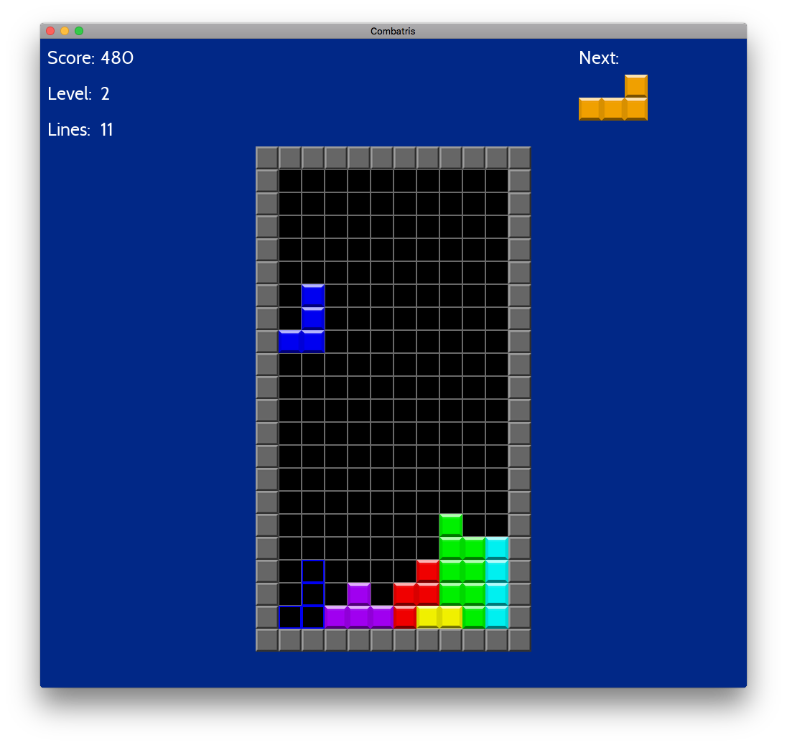

# Combatris - A Tetris Battle clone



An modern C++11/14/17 implementation of Tetris. The game uses the following settings and rules:

Feature | Support
--- | ------
Hold Piece | Yes
Next Pieces shown | 3
Lock Delay with cancel | Yes
Wall kicks | SRS
Infinity limit | 15
Bag randomiser | 7-bag
Top out | Line at 22
Levels | 15
Level advancement | 10 lines
T-Spin recognition | 3-corner with kicks
Back-to-back Recognition | Tetris / T-spin
Platform | PC / Linux / OSX

The plan is to implement three modes Single Player, Battle and Marathon. The single player is done except for
the cosmetic improvements listed below. Its now time to implement network support and battle mode.

**Status**
- [x] Rotate left / right
- [x] Soft / Hard drop
- [x] BPS Random Generator
- [x] Wall kicks (Super Rotating System)
- [X] Hold piece
- [x] T-Spin (scoring)
- [x] T-Spin mini (scoring)
- [x] B2B T-Spin (scoring)
- [x] B2B Tetris (scoring)
- [x] Combos (scoring)
- [X] Perfect clear (cleared matrix after game started)
- [X] Hard Drop & Soft Drop (scoring)
- [X] Panes for score / next tetrominos / hold piece / level and high score
- [X] Pane showing the last clearing move (B2B / Combo / T-Spin / Single / Double /etc.)
- [X] Joystick support (PS3 joystick and Logitech F310 tested)
- [X] Joystick Mapping to enable support for different brands
- [X] Hot add / remove joystick device
- [X] Tetromino Locked animations
- [X] Level up animations
- [X] Score animation
- [X] Lines Cleared Animation
- [X] Count down before game start animations
- [X] Game Over Screen
- [X] Pause Screen
- [X] Splash Screen
- [ ] Battle Mode (P2P based on UDP)
- [ ] Introduce Marathon mode
- [ ] More unit tests // Two in place right now which is far to few

**Improvements**
- [ ] Remove the pane for showing combo/latest move and display combo / last move direct on the frame
- [ ] Add animation for combo/last clearing move (expanding text)
- [ ] Change font to https://www.dafont.com/obelixpro.font
- [ ] Sound
- [ ] Configure which joystick to use (if many available)
- [ ] Move joystick mapping and other settings to a config-file

**Keyboard Commands**

Key | Action
--- | ------
N  | New game
P | Pause
Z | Rotate counter clockwise
Up / X | Rotate clockwise
Left | Move Left
Right | Move Right
Down | Soft Drop
Space | Hard Drop
Shift | Hold piece
Q | Quit

**Joystick Commands (PS3 Controller)**

Key | Action
--- | ------
Start  | New game
Select | Pause
Square | Rotate counter clockwise
Circle | Rotate clockwise
Left | Move Left
Right | Move Right
Down | Soft Drop
Triangle | Hold piece
X | Hard Drop

**Joystick Commands (Logitech F310 Gamepad**

Key | Action
--- | ------
Start  | New game
Select | Pause
X | Rotate counter clockwise
B | Rotate clockwise
Left | Move Left
Right | Move Right
Down | Soft Drop
Y | Hold piece
A | Hard Drop
## Build Combatris

**Dependencies:**
* C++17 compliant compiler (e.g. clang 4, clang-9.0.0, Visual Studio 2017.3)
* C++14 compliant STL implementation
* cmake 3.10.0 or later (for Windows version, for OSX 2.8.0 or later will work)
* git
* SDL2 (x64 only)
* SDL2_ttf (x64 only)
* SDL2_mixer (x64 only)
* Network support when implemented will require boost

The test suit requires catch - Catch will be automatically downloaded and installed
as part of the build process

**OSX / Linux**

Install the required libraries with (linux)brew or any other package manager.

Builds the project, default is a release build. Ninja is used if available:

```bash
make
```

Starts the game:
```bash
make run
```

Runs the test suit:

```bash
make test
```

Run cppcheck (if installed) on the codebase with all checks turned-on:

```bash
make cppcheck
```

**64-bit Windows 10**

The code has been tested with Visual Studio Community Edition 15.6.1

Set the following environment variables (see System Properties/Environment Variables...):

SDL2DIR
SDL2MIXER
SDL2TTFDIR

*Example:*
SDL2DIR C:\SDL2-2.0.5

The PATH environmen variable should include all three libraries lib\x64 directories

*Example:*
PATH C:\SDL2-2.0.5\lib\x64;C:\SDL2_mixer\lib\x64;C:\SDL2_ttf-2.0.14\lib\x64

Generate Visual Studio project files with CMakeSetup.exe

## Credits

Some sources has there own license and is not covered by the source codes license.

* All sfx and music are from www.freesound.org
* Fonts https://www.dafont.com/cabin.font
* Fonts https://www.dafont.com/obelixpro.font
* Wall kick tables from https://harddrop.com/wiki/SRS
* Tetris info from http://tetris.wikia.com and https://tetris.wiki
* Tetrominoes from https://commons.wikimedia.org/wiki/File:Tetrominoes_IJLO_STZ_Worlds.svg
* Original FindSDL2_mixer https://github.com/rlsosborne/doom
* DeltaTimer adapted from http://headerphile.com/sdl2/sdl2-part-9-no-more-delays/
* https://github.com/philsquared/Catch
