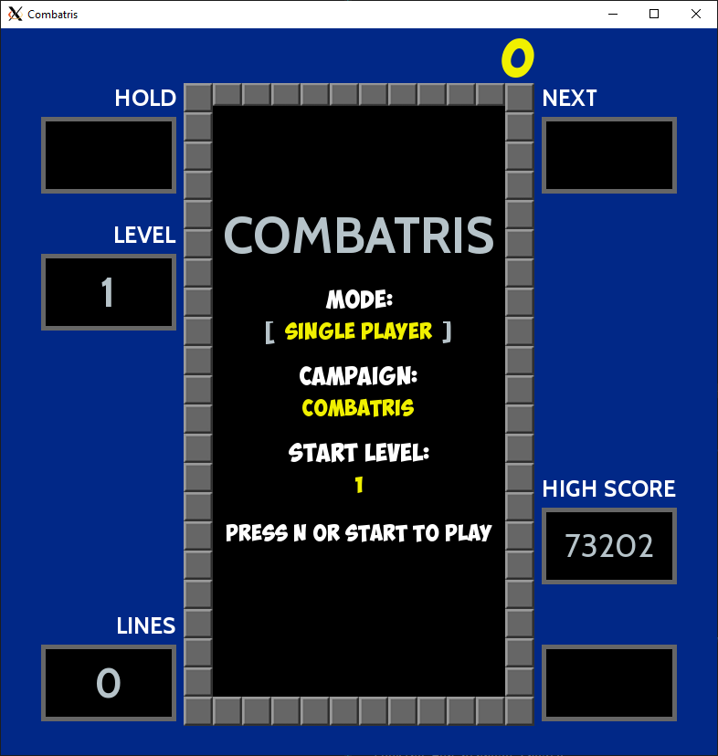
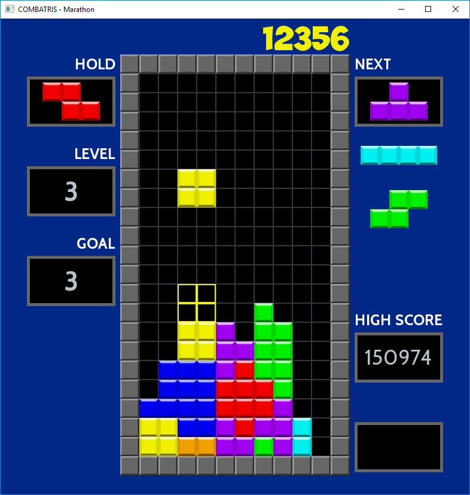
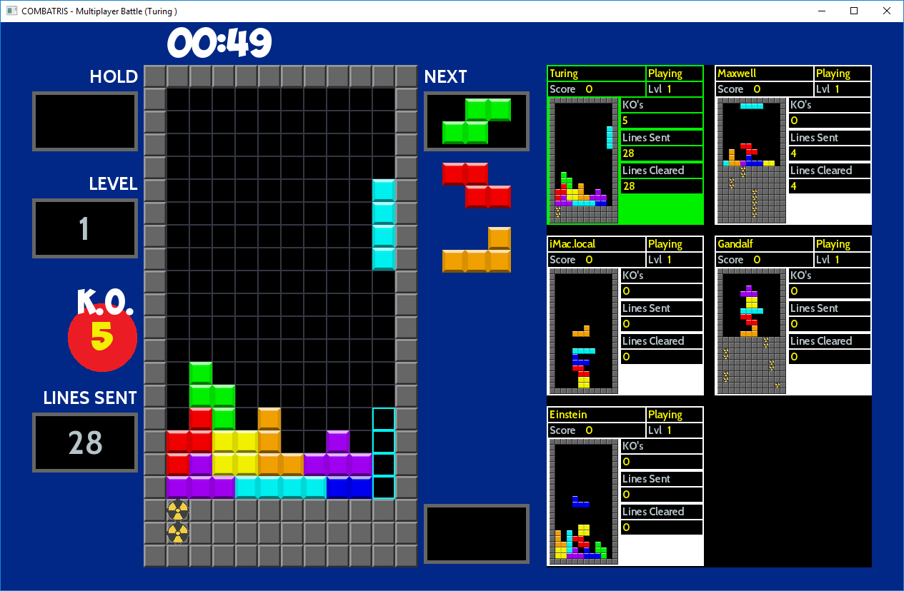

# COMBATRIS - A Tetris clone





A C++ implementation of Tetris. Combatris has been tested and works under Windows 10 (x64 only),
OSX 10.12/10.13/10.14, Raspian GNU/Linux 9 (stretch) and Ubuntu 16.04

Features Combatris, Marathon, Sprint, Ultra Battle campaigns in single and multiplayer mode:

* Combatris and Marathon: The winner is based on score.
* Sprint: The fastest player to clear 40 lines are the winner.
* Ultra: Clear as many lines as possible within 3 minutes.
* Battle: Battle is only judged based on number of lines sent and knockouts (you send so many lines that the opponent cannot perform a valid move).

The game supports both keyboard and Gamepads / Joysticks (listed below).

**The next version will use the offical mappings for gamepads and joysticks.**

I have tested the game with up to five players running on a heterogeneous set of computers using both wireless
and Ethernet based connections. The game works well but there can be lag, since heartbeats are sent
every 200 ms and status updates every 250 ms (if something has happened). Heartbeats are suppressed if
other messages have been sent within the heartbeat interval (to keep network congestion down).

Since its only me playing, and sometimes the family when they feel pity for me, the game most probably
have many bugs left.

Feature | Support
--- | ------
Hold Piece | Yes
Next Pieces shown | 3
Lock Delay with cancel | Yes
Wall kicks | SRS
Infinity limit | 15
Bag randomizer | 7-bag
Top out | Line at 22
Levels | 15
Level advancement | 10 lines / 5 * level Marathon
T-Spin recognition | 3-corner with kicks
Back-to-back Recognition | Combatris / T-spin
Platforms | PC / OSX / Linux / Raspian

**Keyboard Commands**

Key | Action
--- | ------
N  | New game
P | Pause
Z | Rotate counter clockwise
Up / X | Rotate clockwise
Left | Move Left
Right | Move Right
Down | Soft Drop
Space | Hard Drop
Shift | Hold piece
Q | Quit

**Joystick Commands (PS3/PS4 Controller)**

Key | Action
--- | ------
Start/Trackpad  | New game
Select/Option | Pause
Square | Rotate counter clockwise
Circle | Rotate clockwise
Left | Move Left
Right | Move Right
Down | Soft Drop
Triangle | Hold piece
X | Hard Drop

*Tested on OSX only*

**Joystick Commands (Logitech F310 Gamepad)**

Key | Action
--- | ------
Start  | New game
Select | Pause
X | Rotate counter clockwise
B | Rotate clockwise
Left | Move Left
Right | Move Right
Down | Soft Drop
Y | Hold piece
A | Hard Drop

*Tested on Windows, OSX and Raspian*

**Joystick Commands (Retroflag Classic USB Gamepad)**

Key | Action
--- | ------
Start  | New game
Select | Pause
Y | Rotate counter clockwise
A | Rotate clockwise
Left | Move Left
Right | Move Right
Down | Soft Drop
X | Hold piece
B | Hard Drop

*Tested on Raspian*

**Joystick Commands (8Bitdo NES30 Gamepad)**

Key | Action
--- | ------
Start  | New game
Select | Pause
Y | Rotate counter clockwise
A | Rotate clockwise
Left | Move Left
Right | Move Right
Down | Soft Drop
X | Hold piece
B | Hard Drop

*Tested on Raspian*

**Scoring - Combatris Campaign**

Action | Points
------ | ------
Single/T-Spin Mini | 100×level
T-Spin Mini Single | 200×level
Double | 300×level
T-Spin | 400×level
Triple | 500×level
Combatris/T-Spin Single | 800×level
B2B T-Spin Single/B2B Combatris | 1,200×level
T-Spin Double | 1,200×level
T-Spin Triple | 1,600×level
B2B T-Spin Double | 1,800×level
B2B T-Spin Triple | 2,700×level
Combo | 50×combo count×level (singles only for 20)
Soft drop | 1 point per cell (Max of 20)
Hard drop | 2 points per cell (Max of 40)

**Lines Cleared - Marathon Campaign**

Action | Lines Cleared
------ | -------------
Single | 1
T-Spin Mini | 1
T-Spin Mini Single | 2
Double | 3
T-Spin | 4
Triple | 5
Combatris | T-Spin Single | 8
T-Spin Double | 12
T-Spin Triple | 16
Back-to-Back Bonus | 0.5 x Total Line Clears

Finish all 15-levels are considered a win.

**Lines Sent - Battle Campaign**

Move | Lines Sent (Lines per combo step)
---- | ---------------------------------
Single | 0
Double | 1
Triple | 2
Combatris | 4
B2B Combatris | 6
Perfect Clear | 10
T-Spin | 0
T-Spin Mini Single | 1
T-Spin Single | 2
T-Spin Double | 4
T-Spin Triple | 6
B2B T-Spin Mini Single | 2
B2B T-Spin Single | 3
B2B T-Spin Double | 6
B2B T-Spin Triple | 9
0 Combo | 0 (0)
1 Combo | 1 (1)
2 Combo | 2 (1)
3 Combo | 4 (2)
4 Combo | 6 (2)
5 Combo | 9 (3)
6 Combo | 12 (3)
7 Combo | 16 (4)
... Combo | ... (4)

**Status**
- [x] Rotate left / right
- [x] Soft / Hard drop
- [x] BPS Random Generator
- [x] Wall kicks (Super Rotating System)
- [X] Hold piece
- [x] T-Spin (scoring)
- [x] T-Spin mini (scoring)
- [x] B2B T-Spin (scoring)
- [x] B2B Combatris (scoring)
- [x] Combos (scoring)
- [X] Perfect clear (cleared matrix after game started)
- [X] Hard Drop & Soft Drop (scoring)
- [X] Panes for score / next tetrominos / hold piece / level and high score
- [X] Pane showing the last clearing move (B2B / Combo / T-Spin / Single / Double /etc.)
- [X] Joystick support (PS3 joystick and Logitech F310 tested)
- [X] Joystick Mapping to enable support for different brands
- [X] Hot add / remove joystick device
- [X] Tetromino locked animations
- [X] Level up animations
- [X] Score animation
- [X] Lines cleared animation
- [X] Count down before game start animations
- [X] Game Over Screen
- [X] Pause Screen
- [X] Splash Screen
- [X] Battle Mode (P2P based on UDP)
- [X] Introduce KO in Battle mode
- [X] Make Battle Mode timer based
- [X] Wait for all in State waiting to get to Play before starting the game
- [X] In Battle mode show interactive matrix for all players instead of current status
- [X] Introduce Marathon mode for single and multiplayer campaigns
- [X] Introduce VS mode for multiplayer campaign
- [X] Add KO box and sent lines box in battle
- [X] Add possibility to have different UI components based on campaign
- [X] Allow user to change game settings (level, etc) in UI
- [X] Auto discovery of broadcast address (e.g. 192.168.1.255)
- [ ] Refactor out Joystick code into a more reusable component
- [ ] Move joystick mapping and other settings to a config-file
- [ ] Configure which joystick to use (if many available)
- [X] Display Winner / Position on game-over splash screen
- [ ] Add support for TCP/IP so we allow play over internet
- [ ] Sound
- [ ] Remove the pane for showing combo/latest move and display combo/last move direct on the frame
- [ ] Add new animation for combo/last clearing move
- [ ] Unit tests for all score combinations

## Network Considerations

The default port is 11000 and Combatris will try to auto detect the broadcast address. This will work
fine as long as you do not have two active network interfaces (e.g. wifi and ethernet). I do not recommend
having more then one active network interface when playing.

If auto detection of broadcast address failed default will be used (192.168.1.255).

Set the environment variables COMBATRIS_BROADCAST_PORT and COMBATRIS_BROADCAST_IP to
change the port and broadcast IP accordingly.

The network protocol is UDP based and uses a sliding window for handling lost and out of order
packages.

## Build Combatris

**Dependencies:**
* C++17 compliant compiler (tested with clang 5/6, clang-9.x.0 or later, Visual Studio 15.x.x, GCC 7.x.x)
* cmake 3.10.0 or later (Windows) or 3.5.0 or later (OSX/Linux)
* git
* SDL2 (x64 only)
* SDL2_ttf (x64 only)

The test suit requires catch - Catch will be automatically downloaded and installed
as part of the build process

**OSX / Linux**

Install the required libraries with apt/brew or any other package manager.

Builds the project, default is a release build. Ninja is used if available:

```bash
make
```

Starts the game:
```bash
make run
```

Runs the test suit:

```bash
make test
```

Run cppcheck (if installed) on the codebase with all checks turned-on:

```bash
make cppcheck
```

**Raspian GNU/Linux**

You need to activate the OpenGL driver otherwise the game will be far to slow.

The code builds cleanly and has been tested with GCC 7.3.0 and Clang 6.0.0, instructions how
to install the compilers can be found here:

https://solarianprogrammer.com/2017/12/08/raspberry-pi-raspbian-install-gcc-compile-cpp-17-programs/
https://solarianprogrammer.com/2018/04/22/raspberry-pi-raspbian-install-clang-compile-cpp-17-programs/

You need to set these environment variables before running make:

```bash
export PATH=/usr/local/gcc-7.3.0/bin:$PATH
export CXX=gcc-7.3.0
```

or

```bash
export PATH=/usr/local/clang_6.0.0/bin:$PATH
export LD_LIBRARY_PATH=/usr/local/clang_6.0.0/lib:$LD_LIBRARY_PATH
```

**Ubuntu**

The code builds cleanly and has been tested with Clang 5.0.0 and Clang 6.0.0

**64-bit Windows 10**

The code has been tested with Visual Studio Community Edition 15.x.x. Using the following settings:

Download the latest versions of the development libraries at https://www.libsdl.org.

Set the following environment variables (see System Properties/Environment Variables...):

SDL2DIR
SDL2TTFDIR

*Example:*
SDL2DIR C:\SDL2-2.0.5

The PATH environment variable should include both libraries lib\x64 directories

*Example:*
PATH C:\SDL2-2.0.5\lib\x64;C:\SDL2_ttf-2.0.14\lib\x64

Generate Visual Studio project files with CMakeSetup.exe (Choose Visual Studio 15 2017 Win64 as generator)

## Credits

Some sources has there own license and is not covered by the source codes license.

* Font https://www.dafont.com/cabin.font
* Font https://www.dafont.com/obelixpro.font
* Wall kick tables from https://harddrop.com/wiki/SRS
* Game info from http://tetris.wikia.com and https://tetris.wiki
* Tetrominos from https://commons.wikimedia.org/wiki/File:Tetrominoes_IJLO_STZ_Worlds.svg
* Original FindSDL2_mixer https://github.com/rlsosborne/doom
* DeltaTimer adapted from http://headerphile.com/sdl2/sdl2-part-9-no-more-delays/
* https://github.com/philsquared/Catch
