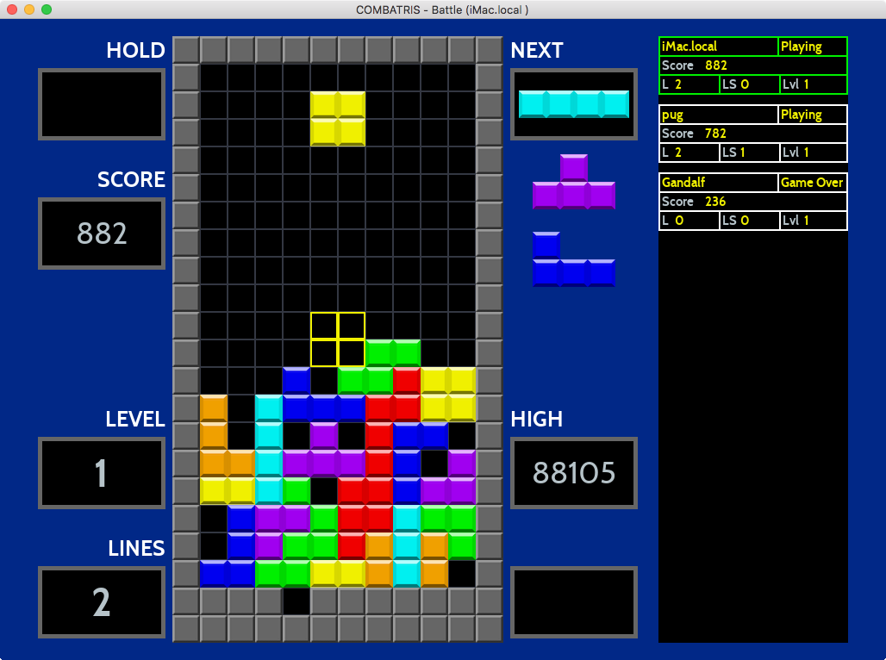

# Combatris - A Tetris clone




A modern C++ implementation of Tetris. Combatris has been tested and works under Windows 10 (x64 only),
OSX 10.12/10.13, Raspian GNU/Linux 9 (stretch) and Ubuntu 16.04

Combatris allows up to 6 players to play against each other. Any line clear over 1 will send lines over
to your opponents. Using combo’s and special moves you can send even more lines and secure the victory.

In the battle campaign score does not matter, number of knock-outs and lines sent are what matters.

You can also play against your self in the single player campaign.

I have tested the game with up to five players running on a heterogeneous set of computers using both wireless
and Ethernet based connections. The game works well but there can be a lag up to 0.5 seconds, since heartbeats
are sent every 0.5 second and status updates every 250 milliseconds (if something has happened). Heartbeats are
suppressed if other messages have been sent within the heartbeat interval (to keep network congestion down).

Since its only me playing, and sometimes the family when they feel pity for me, the game most probably
have many bugs left.

Feature | Support
--- | ------
Hold Piece | Yes
Next Pieces shown | 3
Lock Delay with cancel | Yes
Wall kicks | SRS
Infinity limit | 15
Bag randomiser | 7-bag
Top out | Line at 22
Levels | 15
Level advancement | 10 lines
T-Spin recognition | 3-corner with kicks
Back-to-back Recognition | Tetris / T-spin
Platform | PC / OSX / Linux / Raspian

**Lines Sent - Battle Campaign**

Move | Lines Sent (Lines per combo step)
---- | ---------------------------------
Single | 0
Double | 1
Triple | 2
Tetris | 4
B2B Tetris | 6
Perfect Clear | 10
T-Spin | 0
T-Spin Mini Single | 1
T-Spin Single | 2
T-Spin Double | 4
T-Spin Triple | 6
B2B T-Spin Mini Single | 2
B2B T-Spin Single | 3
B2B T-Spin Double | 6
B2B T-Spin Triple | 9
0 Combo | 0 (0)
1 Combo | 1 (1)
2 Combo | 2 (1)
3 Combo | 4 (2)
4 Combo | 6 (2)
5 Combo | 9 (3)
6 Combo | 12 (3)
7 Combo | 16 (4)
... Combo | ... (4)

**Scoring - Single Campaign**

Action | Points
------ | ------
Single/T-Spin Mini | 100×level
T-Spin Mini Single | 200×level
Double | 300×level
T-Spin | 400×level
Triple | 500×level
Tetris/T-Spin Single | 800×level
B2B T-Spin Single/B2B Tetris | 1,200×level
T-Spin Double | 1,200×level
T-Spin Triple | 1,600×level
B2B T-Spin Double | 1,800×level
B2B T-Spin Triple | 2,700×level
Combo | 50×combo count×level (singles only for 20)
Soft drop | 1 point per cell (Max of 20)
Hard drop | 2 points per cell (Max of 40)

**Status**
- [x] Rotate left / right
- [x] Soft / Hard drop
- [x] BPS Random Generator
- [x] Wall kicks (Super Rotating System)
- [X] Hold piece
- [x] T-Spin (scoring)
- [x] T-Spin mini (scoring)
- [x] B2B T-Spin (scoring)
- [x] B2B Tetris (scoring)
- [x] Combos (scoring)
- [X] Perfect clear (cleared matrix after game started)
- [X] Hard Drop & Soft Drop (scoring)
- [X] Panes for score / next tetrominos / hold piece / level and high score
- [X] Pane showing the last clearing move (B2B / Combo / T-Spin / Single / Double /etc.)
- [X] Joystick support (PS3 joystick and Logitech F310 tested)
- [X] Joystick Mapping to enable support for different brands
- [X] Hot add / remove joystick device
- [X] Tetromino Locked animations
- [X] Level up animations
- [X] Score animation
- [X] Lines Cleared Animation
- [X] Count down before game start animations
- [X] Game Over Screen
- [X] Pause Screen
- [X] Splash Screen
- [X] Battle Mode (P2P based on UDP)
- [X] Introduce KO in Battle mode
- [X] Make Battle Mode timer based
- [X] Wait for all in State waiting to get to Play before starting the game
- [X] In Battle mode show interactive game board for all players instead of current status
- [ ] Introduce Marathon mode for single player campaign
- [ ] Introduce VS mode for battle campaign
- [ ] Sound
- [ ] Remove the pane for showing combo/latest move and display combo/last move direct on the frame
- [ ] Add KO box and Last lines box in battle
- [ ] Add possiability to have different UI components based on campaign
- [ ] Add new animation for combo/last clearing move (expanding text)
- [ ] Configure which joystick to use (if many available)
- [ ] Move joystick mapping and other settings to a config-file
- [ ] Allow user to change  game settings (level, etc) in a config-file or UI
- [ ] Auto discovery of broadcast address (e.g. 192.168.1.255)
- [ ] Write a TCP/IP gateway server for Internet based support
- [ ] Do a proper implementation of the sliding window protocol
- [ ] Unit tests for all score combinations

**Keyboard Commands**

Key | Action
--- | ------
N  | New game
P | Pause
F1 | Toggle Single Player / Battle mode
Z | Rotate counter clockwise
Up / X | Rotate clockwise
Left | Move Left
Right | Move Right
Down | Soft Drop
Space | Hard Drop
Shift | Hold piece
Q | Quit

**Joystick Commands (PS3 Controller)**

Key | Action
--- | ------
Start  | New game
Select | Pause
Square | Rotate counter clockwise
Circle | Rotate clockwise
Left | Move Left
Right | Move Right
Down | Soft Drop
Triangle | Hold piece
X | Hard Drop

**Joystick Commands (Logitech F310 Gamepad)**

Key | Action
--- | ------
Start  | New game
Select | Pause
X | Rotate counter clockwise
B | Rotate clockwise
Left | Move Left
Right | Move Right
Down | Soft Drop
Y | Hold piece
A | Hard Drop

## Network Considerations

The default port is 11000 and default broadcast IP are 192.168.1.255
Use the environment variables COMBATRIS_BROADCAST_PORT and COMBATRIS_BROADCAST_IP to
change the port and broadcast IP accordingly.

The network protocol is UDP based and uses a sliding window for handling lost and out of order
packages.

## Build Combatris

**Dependencies:**
* C++17 compliant compiler (tested with clang 5/6, clang-9.0.0, Visual Studio 2017.3, GCC 7.x.x)
* cmake 3.10.0 or later (Windows) or 3.5.0 or later (OSX/Linux)
* git
* SDL2 (x64 only)
* SDL2_ttf (x64 only)

The test suit requires catch - Catch will be automatically downloaded and installed
as part of the build process

**OSX / Linux**

Install the required libraries with apt/brew or any other package manager.

Builds the project, default is a release build. Ninja is used if available:

```bash
make
```

Starts the game:
```bash
make run
```

Runs the test suit:

```bash
make test
```

Run cppcheck (if installed) on the codebase with all checks turned-on:

```bash
make cppcheck
```

**Raspian GNU/Linux**

You need to activate the OpenGL driver otherwise the game will be far to slow.

The code builds cleanly and has been tested with GCC 7.3.0 and Clang 6.0.0, instructions how
to install the compiler can be found here:

https://solarianprogrammer.com/2017/12/08/raspberry-pi-raspbian-install-gcc-compile-cpp-17-programs/

You need to set these flag before running make:

```bash
export PATH=/usr/local/gcc-7.3.0/bin:$PATH
export CXX=gcc-7.3.0
```

**Ubuntu**

The code builds cleanly and has been tested with Clang 5.0.0 and Clang 6.0.0

**64-bit Windows 10**

The code has been tested with Visual Studio Community Edition 15.6.1. Using the following settings:

Download the latest versions of the development libraries at https://www.libsdl.org.

Set the following environment variables (see System Properties/Environment Variables...):

SDL2DIR
SDL2TTFDIR

*Example:*
SDL2DIR C:\SDL2-2.0.5

The PATH environmen variable should include both libraries lib\x64 directories

*Example:*
PATH C:\SDL2-2.0.5\lib\x64;C:\SDL2_ttf-2.0.14\lib\x64

Generate Visual Studio project files with CMakeSetup.exe (Choose Visual Studio 15 2017 Win64 as generator)

## Credits

Some sources has there own license and is not covered by the source codes license.

* Fonts https://www.dafont.com/cabin.font
* Fonts https://www.dafont.com/obelixpro.font
* Wall kick tables from https://harddrop.com/wiki/SRS
* Tetris info from http://tetris.wikia.com and https://tetris.wiki
* Tetrominos from https://commons.wikimedia.org/wiki/File:Tetrominoes_IJLO_STZ_Worlds.svg
* Original FindSDL2_mixer https://github.com/rlsosborne/doom
* DeltaTimer adapted from http://headerphile.com/sdl2/sdl2-part-9-no-more-delays/
* https://github.com/philsquared/Catch
