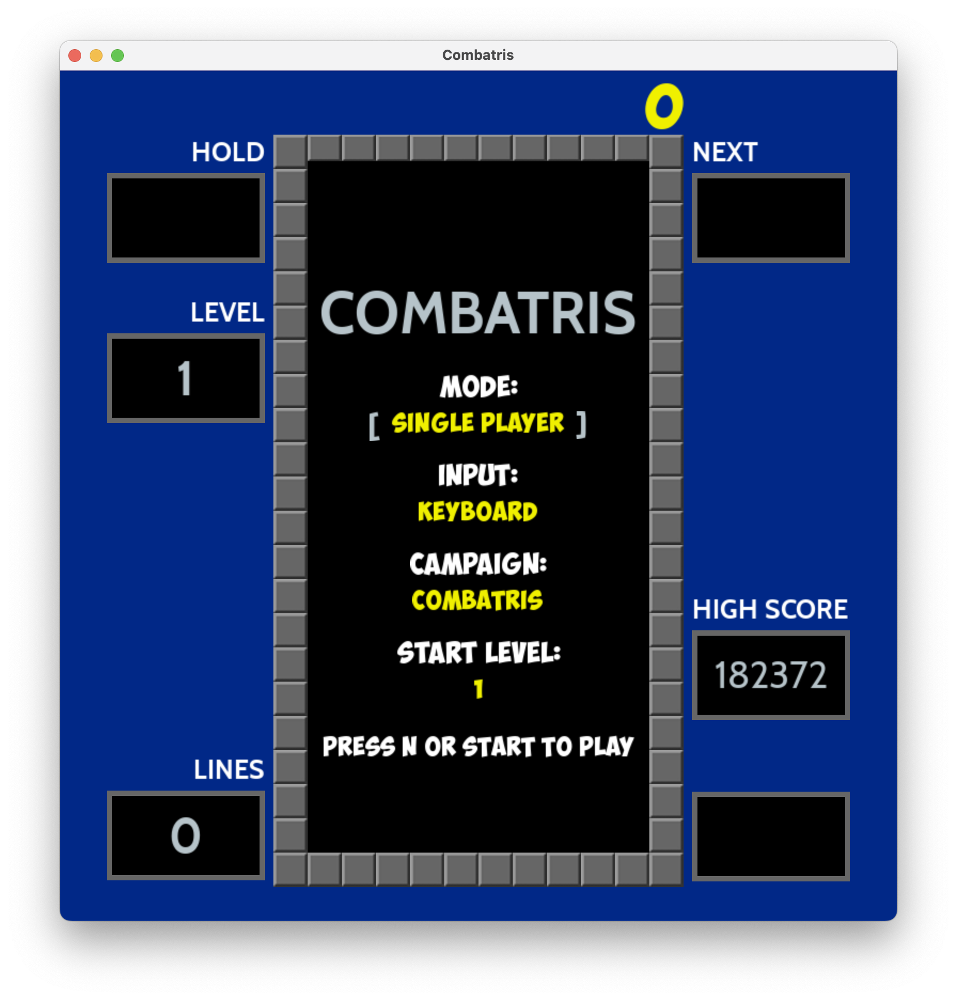
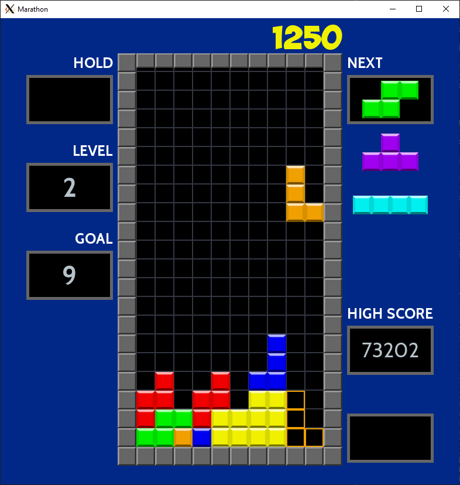
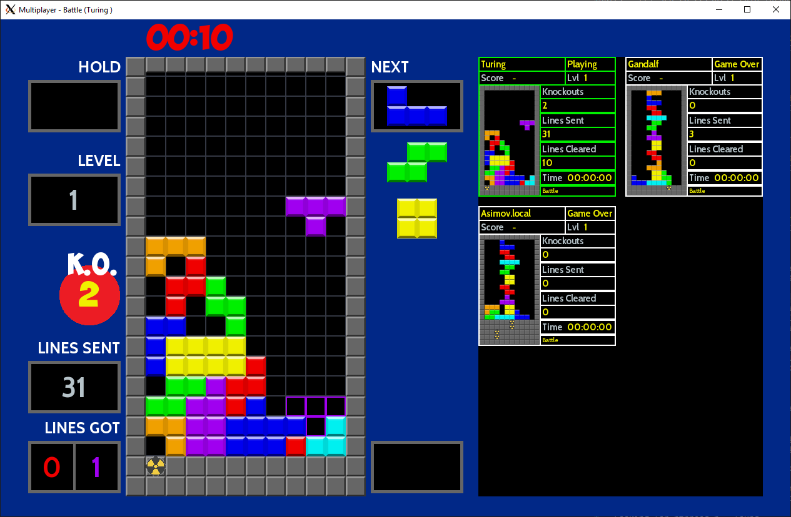

# COMBATRIS - A clone of an old classic





A C++17 implementation of and old classic. Combatris has been tested and works under Windows 10 (x64 only),
OSX 10.12/10.13/10.14, Raspian GNU/Linux 9 (stretch) and Ubuntu 16.04

Features Combatris, Marathon, Sprint, Ultra campaigns in single and multiplayer mode and Battle in multiplayer mode:

* Combatris and Marathon: The winner is judged on score.
* Sprint: The fastest player to clear 40 lines are the winner.
* Ultra: Clear as many lines as possible within 3 minutes.
* Battle: Battle is only judged based on number of lines sent and knockouts (you send so many lines that the opponent cannot perform a valid move).

Feature | Support
--- | ------
Hold Piece | Yes
Next Pieces shown | 3
Lock Delay with cancel | Yes
Wall kicks | SRS
Infinity limit | 15
Bag randomizer | 7-bag
Top out | Line at 22
Levels | 15
Level advancement | 10 lines / 5 * level Marathon
T-Spin recognition | 3-corner with kicks
Back-to-back Recognition | Combatris / T-spin
Platforms | PC / OSX / Linux / Raspian

The multiplayer mode is using a voting mechanism to ensure that everyone is playing the same campaign. The voting rules are simple the campaign
with the greatest number of players wins and any player that want to play another campaign will be rejected. If there is a draw between the number of
players Battle will be prioritized. Any player that are alone in a specific campaign will be rejected.

The game supports both keyboard and Gamepads. The game has been tested with:

* Logitech F310 Gamepad
* PS3/PS4 Controller
* Retroflag Classic USB Gamepad
* 8Bitdo NES30 Gamepad

I have tested the game with up to five players running on a heterogeneous set of computers using both wireless
and Ethernet based connections. The game works well but there can be lag, since heartbeats are sent
every 200 ms and status updates every 250 ms (if something has happened). Heartbeats are suppressed if
other messages have been sent within the heartbeat interval (to keep network congestion down).

Since its only me playing, and sometimes the family when they feel pity for me, the game most probably
have many bugs left.

**Keyboard Commands**

Key | Action
--- | ------
N  | New game
P | Pause
CTRL / Z | Rotate counter clockwise
Up / X | Rotate clockwise
Left | Move Left
Right | Move Right
Down | Soft Drop
Space | Hard Drop
Shift / C | Hold piece
Q | Quit

**Joystick / Game Controller Commands **

Key | Action
--- | ------
Start/Trackpad  | New game
Select/Option/Back | Pause
A/X | Rotate counter clockwise
B/O | Rotate clockwise
Left | Move Left
Right | Move Right
Up | Hard Drop
Down | Soft Drop
Shoulder Buttons | Hold piece

**Scoring - Combatris Campaign**

Action | Points
------ | ------
Single/T-Spin Mini | 100×level
T-Spin Mini Single | 200×level
Double | 300×level
T-Spin | 400×level
Triple | 500×level
Combatris/T-Spin Single | 800×level
B2B T-Spin Single/B2B Combatris | 1,200×level
T-Spin Double | 1,200×level
T-Spin Triple | 1,600×level
B2B T-Spin Double | 1,800×level
B2B T-Spin Triple | 2,700×level
Combo | 50×combo count×level (singles only for 20)
Soft drop | 1 point per cell (Max of 20)
Hard drop | 2 points per cell (Max of 40)

**Lines Cleared - Marathon Campaign**

Action | Lines Cleared
------ | -------------
Single | 1
T-Spin Mini | 1
T-Spin Mini Single | 2
Double | 3
T-Spin | 4
Triple | 5
Combatris | T-Spin Single | 8
T-Spin Double | 12
T-Spin Triple | 16
Back-to-Back Bonus | 0.5 x Total Line Clears

Finish all 15-levels are considered a win.

**Lines Sent - Battle Campaign**

The “got lines” pane are divided into two sections. The first section shows the number of received lines that has not yet been
inserted into the matrix. At this point you can perform a counter attack or at least decreased the number of received lines by
doing a move that sends lines over to your opponent. When the move has been executed any number of lines left in the first
section will be added to your matrix and to the second section of the panes which show the number of solid lines in the matrix.
You cannot send any lines to an opponent until you have cleared all the solid lines in the matrix.

Move | Lines Sent (Lines per combo step)
---- | ---------------------------------
Single | 0
Double | 1
Triple | 2
Combatris | 4
B2B Combatris | 6
Perfect Clear | 10
T-Spin | 0
T-Spin Mini Single | 1
T-Spin Single | 2
T-Spin Double | 4
T-Spin Triple | 6
B2B T-Spin Mini Single | 2
B2B T-Spin Single | 3
B2B T-Spin Double | 6
B2B T-Spin Triple | 9
0 Combo | 0 (0)
1 Combo | 1 (1)
2 Combo | 2 (1)
3 Combo | 4 (2)
4 Combo | 6 (2)
5 Combo | 9 (3)
6 Combo | 12 (3)
7 Combo | 16 (4)
... Combo | ... (4)

**Progress for new features / improvements**
- [X] Change joystick settings to follow the standard
- [X] Use SDL_GameControllerDB
- [ ] Add support for Internet online play
- [ ] Remove the pane for showing combo/latest move and display combo/last move direct on the frame
- [ ] Add new animation for combo/last clearing move
- [ ] Sound
- [ ] Unit tests for all score combinations

## Network Considerations

The default port is 11000 and Combatris will try to auto detect the broadcast address. This will work
fine as long as you do not have two active network interfaces (e.g. wifi and ethernet). I do not recommend
having more then one active network interface when playing.

If auto detection of broadcast address failed default will be used (192.168.1.255).

Set the environment variables COMBATRIS_BROADCAST_PORT and COMBATRIS_BROADCAST_IP to
change the port and broadcast IP accordingly.

The network protocol is UDP based and uses a sliding window for handling lost and out of order
packages.

## Build Combatris

**Dependencies:**
* C++17 compliant compiler (tested with clang 5/6, clang-9.x.0 or later, Visual Studio 15.x.x, GCC 7.x.x)
* cmake 3.10.0 or later (Windows) or 3.5.0 or later (OSX/Linux)
* git
* SDL2 (x64 only)
* SDL2_ttf (x64 only)

The test suit requires catch - Catch will be automatically downloaded and installed
as part of the build process

**OSX / Linux**

Install the required libraries with apt/brew or any other package manager.

Builds the project, default is a release build. Ninja is used if available:

```bash
make
```

Starts the game:
```bash
make run
```

Runs the test suit:

```bash
make test
```

Run cppcheck (if installed) on the codebase with all checks turned-on:

```bash
make cppcheck
```

**Raspian GNU/Linux**

You need to activate the OpenGL driver otherwise the game will be far to slow.

The code builds cleanly and has been tested with GCC 7.3.0 and Clang 6.0.0, instructions how
to install the compilers can be found here:

https://solarianprogrammer.com/2017/12/08/raspberry-pi-raspbian-install-gcc-compile-cpp-17-programs/
https://solarianprogrammer.com/2018/04/22/raspberry-pi-raspbian-install-clang-compile-cpp-17-programs/

You need to set these environment variables before running make:

```bash
export PATH=/usr/local/gcc-7.3.0/bin:$PATH
export CXX=gcc-7.3.0
```

or

```bash
export PATH=/usr/local/clang_6.0.0/bin:$PATH
export LD_LIBRARY_PATH=/usr/local/clang_6.0.0/lib:$LD_LIBRARY_PATH
export CXX=clang
```

If you install a newer version of gcc or clang ensure that you update PATH/LD_LIBRARY/CXX settings accordingly.

**Ubuntu**

The code builds cleanly and has been tested with Clang 5.0.0 and Clang 6.0.0

**64-bit Windows 10**

The code has been tested with Visual Studio Community Edition 15.x.x. Using the following settings:

Download the latest versions of the development libraries at https://www.libsdl.org.

Set the following environment variables (see System Properties/Environment Variables...):

SDL2DIR
SDL2TTFDIR

*Example:*
SDL2DIR C:\SDL2-2.0.5

The PATH environment variable should include both libraries lib\x64 directories

*Example:*
PATH C:\SDL2-2.0.5\lib\x64;C:\SDL2_ttf-2.0.14\lib\x64

Generate Visual Studio project files with CMakeSetup.exe (Choose Visual Studio 15 2017 Win64 as generator)

## Credits

Some sources has there own license and is not covered by the source codes license.

* Font https://www.dafont.com/cabin.font
* Font https://www.dafont.com/obelixpro.font
* Wall kick tables from https://harddrop.com/wiki/SRS
* Game info from http://tetris.wikia.com and https://tetris.wiki
* Tetrominos from https://commons.wikimedia.org/wiki/File:Tetrominoes_IJLO_STZ_Worlds.svg
* Original FindSDL2_mixer https://github.com/rlsosborne/doom
* DeltaTimer adapted from http://headerphile.com/sdl2/sdl2-part-9-no-more-delays/
* https://github.com/philsquared/Catch
* https://github.com/gabomdq/SDL_GameControllerDB
